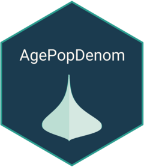

# AgePopDenom  

<!-- badges: start -->
[](https://www.codefactor.io/repository/github/truenomad/agepopdenom)

[](https://github.com/truenomad/agepopdenom/actions/workflows/R-CMD-check.yaml) 
[](https://github.com/truenomad/AgePopDenom/actions/workflows/R-CMD-check.yaml)
<!-- badges: end -->

## What is AgePopDenom?

**`AgePopDenom`** is an R package designed to facilitate the generation of fine-scale, age-structured population denominators for public health decision-making and service delivery. By combining census and household survey data with a novel parameter-based geostatistical modeling approach, the package produces high-resolution (5km x 5km) population estimates disaggregated by age.

------------------------------------------------------------------------


# Installation

## System Requirements

Before installing **AgePopDenom**, ensure your system meets the following requirements:

1.  **R version**: \>= 4.1.0
2.  **C++ compiler**: C++17 compatible
3.  **TMB** (Template Model Builder)

### Platform-Specific Setup

#### Windows

1.  Install Rtools (matches your R version):

``` r
# Check if Rtools is installed and properly configured
pkgbuild::has_build_tools()
```

If FALSE, download and install Rtools from: [CRAN Rtools](https://cran.r-project.org/bin/windows/Rtools/)

**macOS**

1.	Install Command Line Tools:
	
```
xcode-select --install
```

2.	Alternatively, install gcc via Homebrew:

```
brew install gcc
```

**Linux (Ubuntu/Debian)**

1.	Update your system and install necessary packages:

```
sudo apt-get update
sudo apt-get install build-essential libxml2-dev
```
	
## AgePopDenom installation

Once the setup is complete, follow the instructions below to download **AgePopDenom**

Note: **AgePopDenom** is currently under development. Once it is available on CRAN, you will be able to install it using the following command:


```{r eval=FALSE, include=TRUE}
# install.packages("AgePopDenom")
```

To get the development version from GitHub, use:

```{r eval=FALSE, include=TRUE}
# install.packages("devtools")
devtools::install_github("truenomad/AgePopDenom")
```

Then load it in R:

```{r eval=FALSE, include=TRUE}
library(AgePopDenom)
```
------------------------------------------------------------------------

## Core Functions

1. Initialize project structure:
```{r eval=FALSE, include=TRUE}
AgePopDenom::init()
```

2. Download required data:
```{r eval=FALSE, include=TRUE}
# Example for Kenya and Uganda
countries <- c("KEN", "UGA")

# Get DHS data
AgePopDenom::download_dhs_datasets(countries, email = "your_email@example.com")

# Get spatial data
AgePopDenom::download_shapefile(countries)
AgePopDenom::download_pop_rasters(countries)
```

3. Run full analysis:
```{r eval=FALSE, include=TRUE}
AgePopDenom::run_full_workflow(countries)
```

## Documentation

For detailed documentation and examples, visit our [package website](https://truenomad.github.io/AgePopDenom/).

## Features

- Automated data retrieval and processing
- Geostatistical modeling of age structures
- High-resolution population predictions
- Age-specific population denominators
- Visualization and diagnostic tools

## Support and Contributions

For support, bug reports, or feature requests, please contact:

-   **Mo Yusuf** (Package Developer)\
    **Email**: [moyusuf\@who.int](mailto:moyusuf@who.int){.email}\
    **Affiliation**: World Health Organization Regional Office for Africa, P.O. Box 06, Cite du Djoue, Brazzaville, Congo

Alternatively, open an issue on the [GitHub repository](https://github.com/trunomad/AgePopDenom).

We welcome contributions from the community to improve `AgePopDenom`.
