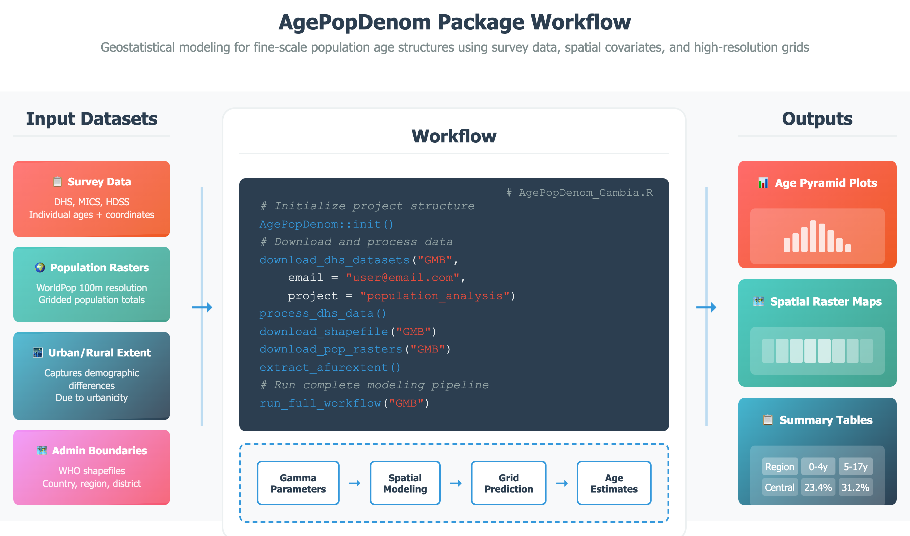
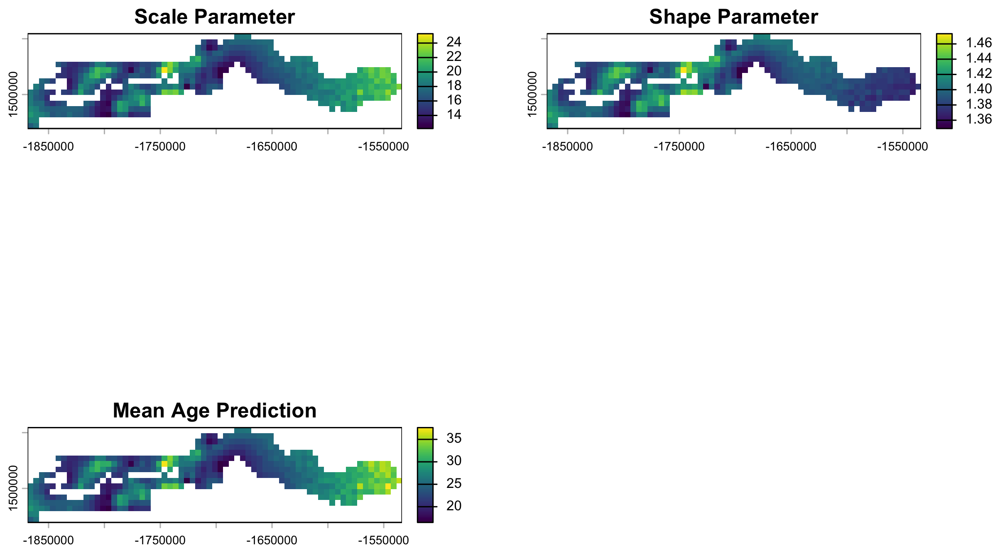

# Summary

`AgePopDenom` is an R package that generates high-resolution (5 km × 5 km) estimates of population by single year of age using publicly available datasets including Demographic and Health Surveys (DHS) [@fabic2012], WorldPop gridded population data [@tatem2017worldpop], and administrative boundaries. It is designed for settings where recent, detailed age data are missing or outdated, common in many low- and middle-income countries.

The package models age distributions using a Gamma distribution framework, well-suited for representing typical age structures. It predicts distribution parameters across space using bivariate geostatistical models with Gaussian processes, capturing spatial autocorrelation in demographic characteristics. Users can include covariates such as urban/rural status to guide predictions. This approach models age structure as a high-resolution surface, capturing spatial heterogeneity rather than assuming uniformity within large regions, producing spatially continuous age-disaggregated estimates even in unsampled locations (\autoref{fig:workflow}).

`AgePopDenom` is, to our knowledge, the first R package to operationalize a parameter-based geostatistical approach for modeling full age structures at fine spatial resolution. Unlike existing tools that focus on demographic simulation or limited health indicators, it integrates survey microdata, gridded population rasters, administrative boundaries, and user-defined covariates into a single streamlined workflow. The spatial modeling uses Template Model Builder (TMB) [@kristensen2016] for efficient C++-based optimization, reducing computation time from 2–3 hours to 7–10 minutes per country.



# Statement of need

Accurate and spatially explicit age-structured population data are essential for public health planning, disease surveillance, and development efforts. Such data form the basis for estimates of disease burden, vaccination coverage, and intervention impact, aiding governments and organizations in allocating resources effectively [@tatem2014; @diaz2021; @hay2006]. Yet granular age-disaggregated data remain scarce. Census data are infrequent and often lack subnational detail. National projections offer interim estimates, but their aggregate assumptions limit utility for local planning. Microdata from National Statistical Offices are often inaccessible due to restrictions [@linard2011; @stevens2015]. Household surveys such as DHS and MICS provide rich demographic data but are not designed for subnational estimation [@boerma1993; @ye2012]. This creates a persistent gap in small-area, age-structured population estimates.

Despite advances in fine-scale population modeling, particularly for total population and select age groups like under-fives [@stevens2015; @wardrop2018; @alegana2015; @pezzulo2017], methods for estimating full age distributions remain limited. Traditional techniques like spline interpolation [@mcneil1977; @fukuda2010] lack spatial detail, top-down census disaggregation relies on outdated baselines, and bottom-up models typically exclude age [@wardrop2018]. AgePopDenom addresses this gap by modeling continuous age distributions via Gamma parameterization with bivariate Gaussian processes, delivering high-resolution estimates with built-in uncertainty quantification.

# State of the field

Several existing R packages address adjacent topics but none support empirical, geostatistical modeling of full age structures at fine spatial resolution. Simulation-oriented tools such as `IBMPopSim` [@giorgi2023efficient], `demogR` [@demogR], `demography` [@demography2024], `popdemo` [@stott2012popdemo], and `mpmsim` [@jones2025mpmsim] focus on cohort or matrix-based demographic modeling rather than empirical spatial estimation. `SUMMER` [@summer2025] supports small-area estimation of survey-based indicators but is limited to specific outcomes like under-five mortality. Similarly, `ungroup` [@pascariu2018ungroup], `sptotal` [@higham2023sptotal], and `APCtools` [@bauer2018apctools] address age unbinning, spatial aggregation, and cohort analysis respectively, without modeling full age structures spatially. The `wpp2024` [@wpp2024] package, based on official UN model life table projections, provides standardized national age patterns but lacks spatial granularity and the ability to incorporate covariates.

`AgePopDenom` fills this gap by operationalizing a parameter-based geostatistical approach for modeling full age structures. Rather than contributing to existing packages, we built a standalone tool because the core requirement—joint spatial prediction of Gamma distribution parameters via bivariate Gaussian processes—is architecturally distinct from the single-outcome focus of packages like `SUMMER` or the simulation paradigms of demographic modeling tools. `AgePopDenom` integrates well-maintained packages (`rdhs` for survey microdata, `terra` for gridded population rasters) into a reproducible pipeline with modular functions for each workflow stage.

# Software design

`AgePopDenom`'s architecture reflects three key design decisions: (1) a parameter-based approach to age modeling, (2) computational efficiency through compiled code, and (3) an end-to-end automated workflow.

Rather than storing and interpolating raw age counts, which would be memory-intensive and noisy, we model age distributions via Gamma parameters (shape and scale), reducing the problem to predicting two smooth spatial surfaces. This parameterization naturally captures typical age-structure shapes while enabling uncertainty quantification through the fitted distribution. For computational efficiency, spatial modeling is implemented using Template Model Builder (TMB) [@kristensen2016], which compiles model specifications to C++ and uses automatic differentiation for optimization, making the approach practical for operational use.

# Research impact statement

`AgePopDenom` addresses a critical data gap in low- and middle-income countries where detailed age-structured population estimates are essential for public health planning but rarely available at subnational scales. The package represents a novel capability: to our knowledge, it is the first R tool to operationalize geostatistical modeling of full age structures at fine spatial resolution. The primary outputs are age-disaggregated population denominators for downstream epidemiological and demographic analyses.

The package is distributed under an MIT license, includes CI/CD testing across macOS, Windows, and Ubuntu, and provides documented, runnable workflows. The package integrates with established data ecosystems including the DHS Program and WorldPop, facilitating immediate application in settings where these data sources are already used.

Collaboration with WHO AFRO and WorldPop (University of Southampton) makes evaluation and potential near-term use of `AgePopDenom` in operational settings possible. Target applications include vaccination coverage estimation, disease burden assessment, and resource allocation, all domains where age-disaggregated denominators directly influence policy decisions. The package's efficiency makes it practical for routine use by national statistical offices and health ministries, supporting evidence-based health planning in data-sparse settings. Future extensions will incorporate temporal dynamics, Bayesian uncertainty frameworks, and support for additional survey types.

# Mathematics

Ages are modeled using a Gamma distribution for each survey cluster. Let $A_{ij}$ represent the age of the $j$-th individual in cluster $i$. Each $A_{ij}$ is assumed to follow a Gamma distribution with spatially varying shape $\alpha(x_i)$ and scale $\lambda(x_i)$, modeled as latent fields:

$$A_{ij} \sim \text{Gamma}(\alpha(x_i), \lambda(x_i))$$

The parameters are estimated via maximum likelihood as functions of a bivariate Gaussian Process over spatial locations $x_i$. The fitted Gaussian process generates predictions of Gamma parameters at unobserved locations, capturing spatial correlation and allowing smooth interpolation across space. The Gamma cumulative distribution function is then applied to compute proportions in any defined age group, supporting fine-scale age-disaggregated estimation.

# Example

```r
# Note: Run within an RStudio Project for correct relative paths
install.packages("AgePopDenom")
AgePopDenom::init()
AgePopDenom::download_dhs_datasets(
  "GMB", email = "email@example.org", project = "demo"
)
AgePopDenom::process_dhs_data()
AgePopDenom::download_shapefile("GMB")
AgePopDenom::download_pop_rasters("GMB")
AgePopDenom::extract_afurextent()
AgePopDenom::run_full_workflow("GMB")
```

Users without DHS data access can run the same workflow end-to-end by replacing the `download_dhs_datasets()` and `process_dhs_data()` steps with `simulate_dummy_dhs_pr()`, which generates a DHS-like survey dataset for The Gambia (a pre-simulated copy is also shipped with the package). \autoref{fig:outputs} shows outputs from this simulated workflow: predicted Gamma parameter surfaces and the resulting mean-age prediction at 5 km × 5 km resolution. The workflow also produces age-stratified population tables with 95% uncertainty intervals, regional age pyramids, and a compiled spreadsheet of denominators.



# AI usage disclosure

Generative AI tools were used during the development of this work. Specifically, AI assistance was used for debugging during software development and for editing and refining the manuscript text. All AI-generated suggestions were reviewed, validated, and modified by the authors. The corresponding author takes full responsibility for the final content.

# Acknowledgements

We acknowledge the DHS Program for providing access to survey data and WorldPop for gridded population datasets. This work was supported by funding from the World Health Organization and the University of Southampton.

# References
